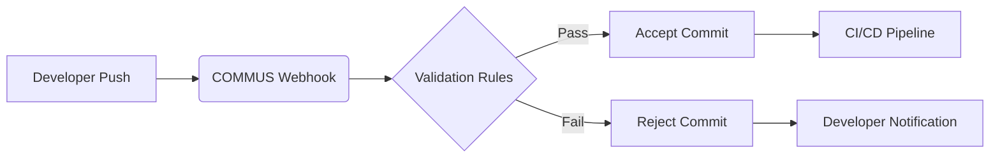

Automation is at the heart of efficient DevOps practices. COMMUS leverages webhook-based integrations to provide robust automation capabilities, helping teams enforce rules and collect actionable insights.

**How It Works**
1. **Webhook Integration:** COMMUS registers pre-receive webhooks with your Git repository. Every push triggers a validation request to the COMMUS REST API.
2. **Custom Rules Engine:** Validate branch patterns, run static code analysis, and enforce test coverage thresholds before allowing the push.
3. **Analytics Dashboard:** Track commit metrics, policy violations, and team performance over time, enabling data-driven improvements.

Integrating COMMUS into your development pipeline means fewer manual checks and faster feedback loops. Start automating your SDLC governance today—explore our [integration guide](#) for step-by-step instructions.
